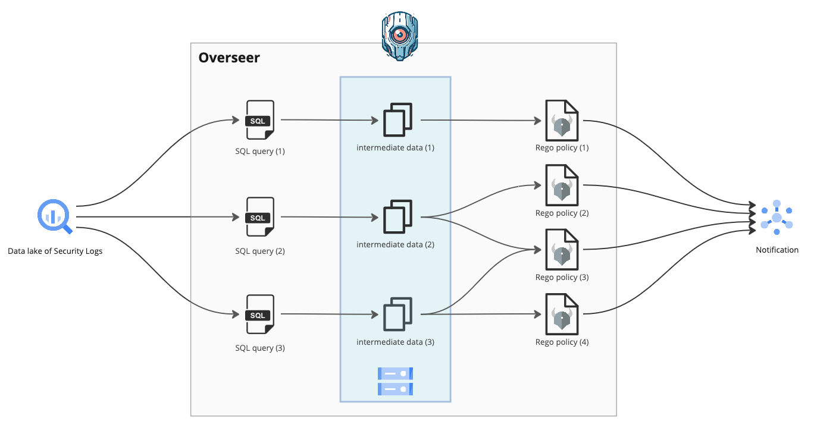

# overseer

Overseer is a security log analysis tool for data lake with combination of **SQL query** and **Rego policy**. It's designed to be used in BigQuery.

## Overview

Security log analysis is a critical task for security monitoring to detect suspicious activities. For data lake like Google BigQuery, SQL query is a common way to analyze logs. However, it's hard to manage and maintain the SQL queries for security monitoring. Overseer provides a way to manage and maintain the security monitoring queries with not only SQL but also [Rego](https://www.openpolicyagent.org/docs/latest/policy-language/) policy.

### Why SQL and Rego?

SQL is a common language for data analysis to extract, transform and correlation logs in data lake and it's easy to write queries. However, it's hard to manage and maintain the queries for security monitoring. For example, it's not better to maintain a lot of exception rules in SQL queries.

[Rego](https://www.openpolicyagent.org/docs/latest/policy-language/) is a policy language for Open Policy Agent (OPA) and it's designed to manage and maintain the generic policies. Rego has the following features as a rule language for security monitoring:

- Composable: Rego policies are composable, which means you can write small, reusable policies and combine them to create more complex policies.
- Testable: Rego policies are testable, which means you can write unit tests to ensure that your policies behave as expected.

Overseer provides a way to manage and maintain the security monitoring queries by using combination of SQL and Rego.

### Architecture

Overseer performs log analysis in two main steps:

1. **SQL query**: Executes SQL queries for log analysis against BigQuery. SQL queries are used to extract, transform, and join logs. The extracted logs are saved as intermediate files in local storage or Google Cloud Storage.
2. **Rego policy**: Executes Rego policies based on the logs extracted by the SQL queries. Rego policies validate the extracted logs and generate alerts. The generated alerts are sent to PubSub.

The logs saved as intermediate files can be reused. This allows for repeated policy validation, which is useful not only for generating alerts but also for debugging when unintended alerts are generated and for testing when updating policies.

## Documents

- [Getting Started](doc/getting_started.md)
- [How to write rules](doc/rules.md)
- [Usage](doc/usage.md)

## License

This project is licensed under the Apache License 2.0 - see the [LICENSE](LICENSE) file for details.
